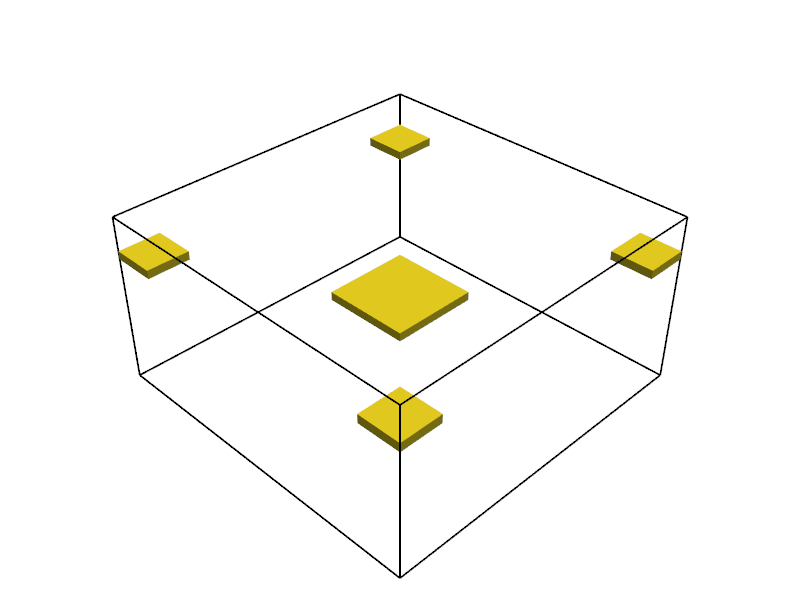
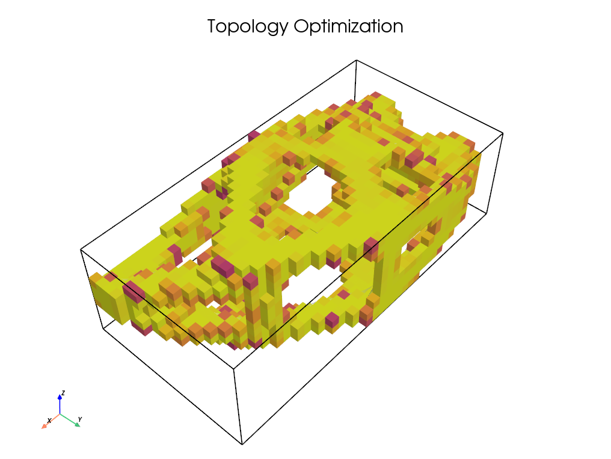
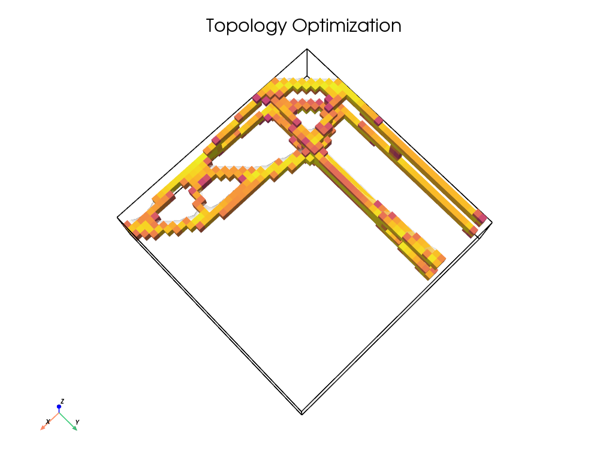
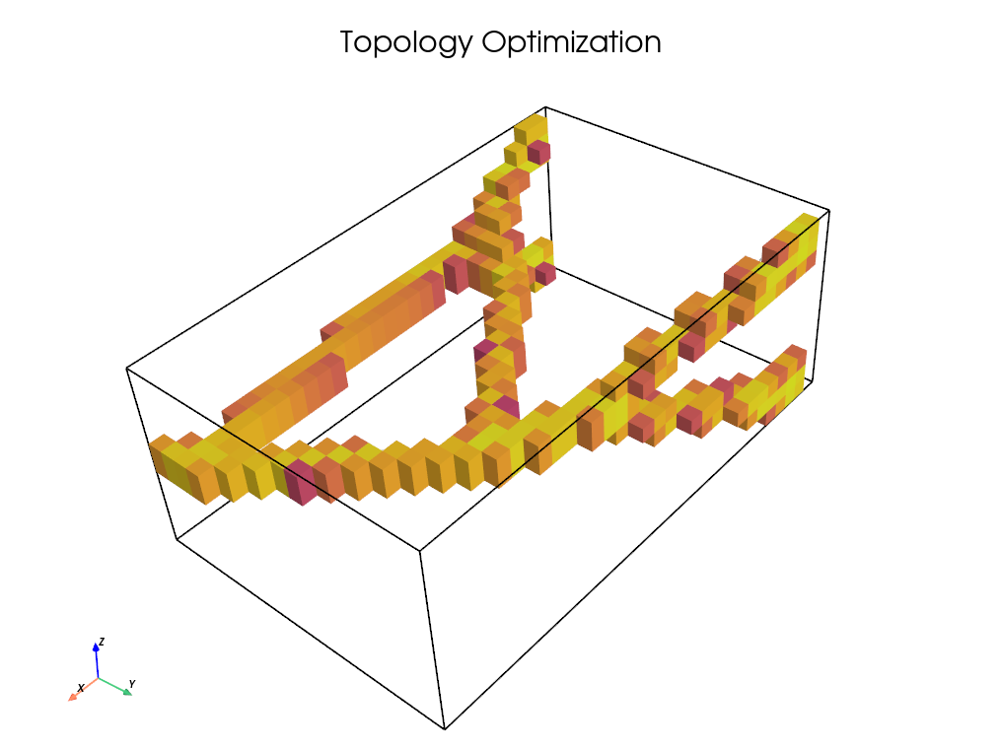
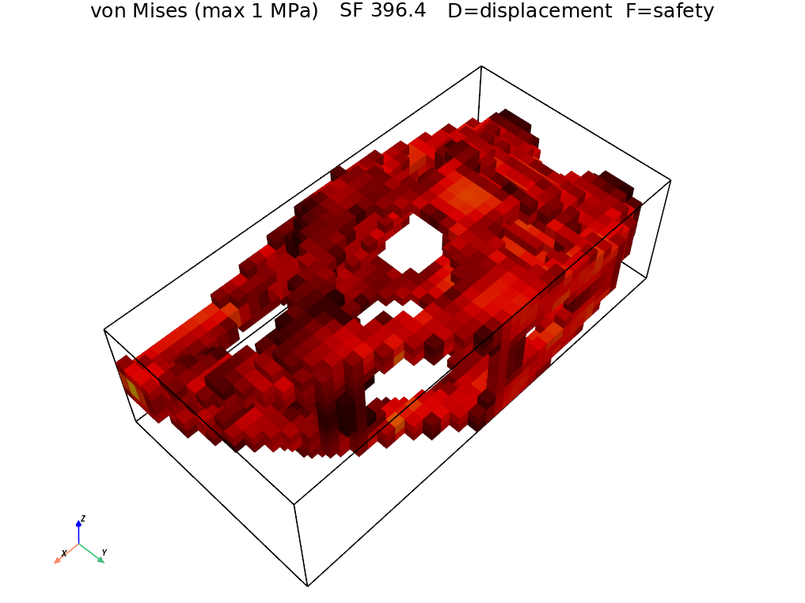

# phoenix

**Topology optimisation engine**: from scene definition to live 3D optimisation and STL export.

<p align="center">
  
</p>

---

## What is it?

Phoenix is a Python topology optimisation framework. You define a scene (a design domain with supports, loads, and keep-out regions), pick a physics solver, and watch the optimiser model material in a **live 3-D viewer**, leaving only the stiffest, lightest, or most efficient shape for the job.

Here is the pipeline:

```
scene definition  ->  voxel grid  ->  FE solve  ->  density update  ->  live render  ->  STL export
```

---

## Features

- Scene builder: define domains with boxes, cylinders, unions, and subtractions in JSON or Python
- 8 physics solvers: structural, thermal, convection, vibration, gravity, stress-constrained, max-length, multi-physics (or implement your own)
- Live 3D viewer: watch density evolve in real time
- STL export: marching cubes and smoothing
- JSON settings: tune every solver from a single settings file
- Continuation: coarse -> fine grid refinement for high-res results

---

## Quick start

```bash
# Clone and install
git clone https://github.com/dapsvi/phoenix.git
cd phoenix
uv sync

# Run your first optimisation
python cli.py optimize presets/json/bridge.json
```

The live viewer opens automatically. When it finishes you will find:
- `results/bridge_latest.npz`: full density field and history
- `exports/bridge.stl`: smoothed mesh ready for printing

---

## Scene definition

Scenes are built from primitives (boxes, cylinders) with union, subtract, and intersect operations.

### JSON format

```json
{
  "name": "bridge",
  "nx": 50, "ny": 24, "nz": 10,
  "suggested_settings": "structural",
  "objects": [
    { "type": "box", "bounds": [0, 49, 0, 23, 0, 9], "kind": "solid" },
    { "type": "box", "bounds": [0, 0, 0, 0, 0, 9], "kind": "solid", "bc": "support", "constraint": "fix" },
    { "type": "box", "bounds": [0, 49, 23, 23, 3, 6], "kind": "solid", "bc": "load", "direction": [0, -1, 0] }
  ]
}
```

### Python API

```python
from scene import Scene, Box

scene = Scene("bridge", 150, 50, 10)
scene.add(Box(0, 149, 0, 49, 0, 9, kind="solid"))
scene.add(Box(0, 0, 0, 0, 0, 9, kind="fixed_solid", bc="support", constraint="fix"))
scene.add(Box(0, 149, 23, 23, 3, 6, kind="fixed_solid", bc="load", direction=(0, -1, 0)))
```

---

## Included solvers

| Solver         | Settings file              | What it optimises                         |
| ----------------| ----------------------------| -------------------------------------------|
| **Structural** | `settings/structural.json` | Compliance (stiffness) under static loads |
| **Thermal**    | `settings/thermal.json`    | Heat conduction and thermal compliance    |
| **Convection** | `settings/convection.json` | Convection-dominated heat transfer        |
| **Vibration**  | `settings/vibration.json`  | Eigenfrequency maximisation               |
| **Gravity**    | `settings/gravity.json`    | Body-force (self-weight) loading          |
| **Stress**     | `settings/stress.json`     | Stress-constrained optimisation           |
| **MaxLength**  | *(inline config)*          | Maximum member length scale control       |
| **Multi**      | `settings/drone.json`      | Multi-physics (combines solvers)          |

Example settings file (`settings/structural.json`):

```json
{
  "type": "structural",
  "material": "aluminum",
  "volfrac": 0.05,
  "penal": 3.0,
  "rmin": 2.0,
  "move": 0.2,
  "max_iter": 100,
  "tol": 0.001
}
```

---

## CLI

```
python cli.py optimize <preset>   Run optimisation with live viewer
python cli.py export <result>     Convert .npz result to STL
python cli.py view <result>       Open result in the 3D viewer
```

### CLI optimize flags

| Flag             | Default   | Description                                            |
| ------------------| -----------| --------------------------------------------------------|
| `-s, --settings` | auto      | Solver settings (file name or inline)                  |
| `--threshold`    | `0.5`     | Density isosurface threshold                           |
| `--cmap`         | `viridis` | Colormap for the density field                         |
| `--final`        | `best`    | `best` (lowest compliance) or `last` (final iteration) |
| `--no-stl`       |           | Skip STL export                                        |
| `--no-verify`    |           | Skip FE verification pass                              |
| `--no-view`      |           | Skip the 3-D viewer                                    |

---

## Presets

Ready-to-run examples in `presets/`:

| Preset                | Description                                   |
| -----------------------| -----------------------------------------------|
| `bridge.json`         | Simply-supported bridge with distributed load |
| `cantilever.json`     | Classic cantilever beam                       |
| `mbb_beam.json`       | MBB beam (half model, symmetry)               |
| `michell_truss.json`  | Michell truss / force path                    |
| `lbracket.json`       | L-bracket with fillet stress path             |
| `drone.json`          | Drone frame, multi-load-case                  |
| `heat_sink.json`      | Thermal heat sink                             |
| `cooled_block.json`   | Convection-cooled block                       |
| `cantilever_vib.json` | Vibration / eigenfrequency                    |

<p align="center">
  
  
  
</p>

---

## Output

After a run you get:

- **`.npz` result**: full 3-D density field, iteration history, and solver snapshots
- **`.stl` mesh**: smoothed isosurface, ready for 3-D printing or CFD meshing
- **Verification report**: FE re-solve confirming the design meets constraints

<p align="center">
  
</p>

---

## Dependencies

- `numpy`, `scipy`: core numerics
- `pyamg`: algebraic multigrid preconditioner
- `pypardiso`: sparse direct solver (Intel MKL Pardiso)
- `pyvista`: 3-D visualisation and mesh processing
- `vpython`: interactive viewer support
- Python >= 3.13

---

## License

[GNU GPLv3](LICENSE)
